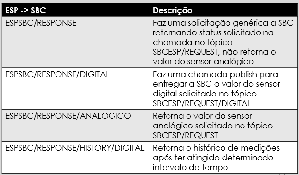

# IoT: A internet das Coisas
O objetivo deste projeto foi a implementação de um sistema Iot com o uso do protocolo de comunicação MQTT a fim de entender como integrar diferentes sistemas. Desde da a integração de diferentes sensores e o controle desses em uma NodeMCU,  a qual se comunica com um computador central que possui uma interface local IHM composta por um display LCD, até uma interface remota em forma de aplicativo.

## Equipe de desenvolvimento
- [Lara Esquivel](github.com/laraesquivel)
- [Diego Rocha](github.com/Diego10Rocha)
- [Israel Braitt](github.com/israelbraitt)

## Descrição do problema

O sistema proposto é composto por três módulos: o do ESP8266, a SBC e a interface em aplicativo, todavia o implementado é composto por apenasa dois módulos e um software externo utilizado em testes que foi utilizado como interface que é o MQTT Explorer. Mas de forma geral foi implementado o protocolo de comunicação MQTT entre uma SBC (Single Board Computer) Orange Pi PC Plus e um ESP8266 NodeMCU ESP-12, o protocolo não ocorre entre a SBC e o software externo. Primeiramente não foi implementado na SBC uma comunicação com um outro sistema além do ESP8266 , além disso o software consegue ver qualquer requisição que tenha sido feita por meio do Broker do LEDS.


No diagrama acima, observe que temos três módulos básicos: a interface, a SBC e a NodeMcu que se comunicam em uma rede interna (INTELBRAS) por meio do protocolo MQTT. Dentro do módulo da interface, o backend e a interface propriamente dita foram desconsiderados pois não são operacionais mas representa a forma a qual foi pensado o projeto, e nisso sobrou o MQTT Explorer o qual é possível por meio desse observar gráficos das medições.

A SBC consegue se comunicar com a NodeMCU por meio de tópicos e assim consegue: solicitar e receber valor do sensor analógico, as medições recentes, o estado e o valor de um sensor digital especificado,, além de configurar o tempo de medição dos sensores associados a NodeMCu. Enquanto a NodeMcu consegue captar e enviar os dados dos 9 sensores associados( 8 digitais e 1 analógico), enviar os estado de funcionamento do ESP8266 e de conexeção com internet e o broker, enviar as medições solicitadas e as não solicitadas dado um intervlo de tempo configurado por meio da SBC.


#### Recursos utilizados
- Orange Pi PC Plus
- GPIO Extension Board
- Display LCD Hitachi HD44780U
- Botões
- ESP8266 NodeMCU ESP-12
- Software MQTT Explorer
- Ardunio IDE
- Paho MQTT C Client
- Wiring Pi

### Como executar o projeto
Realize o download dos arquivos main.c, nodemcu.ino e makefile.

#### SBC

Os arquvios main.c e makefile devem permanecer juntos. Os transfira para a Orange Pi PC Plus. Os arquivos podem ser transferidos por meio do comando *scp*

```
$ scp diretorio_origem user@IP:diretorio_destino
```

Execute o comando a seguir para compilar o código:
```
$ make
```
Em seguida execute o comando a seguir para executar o programa:
```
$ sudo ./main
```

Obs: Verifique se as bibliotecas WiringPi e Paho MQTT C Client estão instaladas
#### NodeMCU 

Utilize o software [Arduino IDE](https://www.arduino.cc/en/software) para executar o arquivo nodemcu.ino, certifique-se de que as bibliotecas abaixo estejam devidamente instaladas:

- TimedAction.h
- ESP8266WiFi.h
- ESP8266mDNS.h
- WiFiUdp.h
- ArduinoOTA.h
- PubSubClient.h
- stdlib.h
- string.h

Dependendo do ESP que for executado, troque o endereço de IP para não desconfigurar as NodeMCU do LEDS e coloque o endereço descrito na placa disponível. Para baixar o código conecte a rede INTELBRAS e faça o upload por rede. Caso tenha o ESP individual é possível fazer o upload por cabo, troque por IP diferente dos já existentes.

Obs: Caso for fazer uso fora do LEDS, troque a configuração do broker: endereço, usuário e senha. Além disso, configure o nome e a senha da rede utilizada. Isso também vale para a SBC. 


## Metodologia e Soluções


### O protocolo MQTT
O protocolo de comunicação utilizado é o [MQTT](https://mqtt.org/) (Message Queuing Telemetry Transport ou Transporte de Filas de Mensagem de Telemetria), que permite a transmissão e recebimento de mensagens através do modelo Publisher-Subscriber, em que os dispositivos podem publicar ou receber mensagens a depender da sua função no sistema. As mensagens são enviadas através de tópicos, que funcionam como endereços pelo quais as mensagens serão enviadas.

Um dispositivo pode emitir uma mensagem para determinado tópico, sendo chamado de publicador (publisher) ou receber uma mensagem de um tópico, sendo chamado de inscrito (subscriber). Esses tópicos ficam organizados em um servidor denominado broker que é responsável por intermediar as comunicações, tornando possível o recebimento, enfileiramento e envio das mensagens. Os dispositivos que têm capacidade de interagir com o broker são chamados de clientes. Os pacotes de dados trocados entre os clientes e o broker são denominados mensagens, estes podem possuir um header que possui informações como o tipo de comando e o tamanho do pacote de dados e payload que seria a carag útil ou conteúdo da mensagem.

Dessa forma foram criados sete tópicos para realizar a comunicação entre a NodeMCU e a SBC. Três deles publicados pela SBC e o restante publicado pela NodeMCU.


Para o primeiro tópico da tabela acima *SBCESP/REQUEST*, a mensagem é utilizada para determinar o que o ESP irá fazer

- 0x04: Captar valor do sensor analógico
- 0x03: Solicitar estado da NodeMCU
- 0x06: Ascender Led
- 0x07: Apagar Led
- 0x08: Solicitar estado da conexão (SBC não implementou isso, todavia a NodeMCU sim)

Para o segundo tópico *SBCESP/REQUEST/DIGITAL* deve ser passado o número(0 a 7) correspondente ao sensor como mensagem, e para *SBC/TIMEINTERVAL* deve ser passado o tempo de medição, isso pode ser configurado na interface local por meio dos botões.



Para o tópico da tabela acima *ESPSBC/RESPONSE*, a mensagem retorna algum dos estados, seja esse o estado da NodeMCU ou de conexão. Enquanto *ESPSBC/RESPONSE/DIGITAL* retorna o valor do sensor digital solicitado, em analogo tem o tópico *ESPSBC/RESPONSE/ANALOGOGICO* para o sensor digital. *ESPSBC/RESPONSE/HISTORY/DIGITAL* me retorna o histórico dos sensores.


### Orange Pi PC Plus
O código do arquivo [main.c](/main.c) é responsável por controlar a Orange Pi, implementando a lógica de comunicação do protocolo MQTT nessa placa e controlando os periféricos conectados na mesma.
Para fazer o mapeamento dos pinos da Orange Pi foi utilizada a bilbioteca **WiringPi**, possibilitando a conexão da mesma com o display LCD e com os botões (que representa a interface local do usuário).

Para configurar o protocolo MQTT foi utilizada a bilbioteca **Paho MQTT C Client** (ver Materiais de Referência) responsável por fazer a conexão da placa como um cliente no broker, se inscrever e publicar nos devidos tópicos. Os parâmetros *username*, *password*, *broker_address* e *client_id* estão configurados com os dados usados nos testes realizados durante o desenvolvimento em laboratório, mas podem ser alterados com os dados necesários de alguma outra aplicação.

A comunicação ocorre via TCP e com opção de login e Transport Layer Security(TLS) que é a camada de segurança de transporte. Possui também níveis de [QoS](https://www.youtube.com/watch?v=qRV8Jusu-go)(Quality of Service) ou qualidade de serviço, no qual cada nível pode ser utilizado por um tipo de aplicação específica, visto que quanto maior o nível, maior é o número de comunicações entre um computador e o broker, pois é necessário garantir as informações enviadas. Há 3 níveis de qualidade de serviço e são eles:

- QoS 0: Envia a mensagem no máximo uma vez, se o broker recebeu, recebeu, caso não tenha recebido a informação não será enviada novamente.

- QoS 1: O nível um lhe garante que pelo menos uma mensagem chegará ao destino, entretanto podem chegar mais de uma mensagem, pois são disparadas várias mensagens para garantir que ao menos uma chegue e o disparo de mensagens só é parado quando ele recebe do broker que a mensagem chegou.

- QoS2: Este nível garante que uma e apenas uma mensagem chegará ao destino, o que requer maior complexidade, pois o publisher ou subscriber vai mandar mensagem para o broker e esperar a confirmação dele, caso não ocorram será gerado um timeout e será enviado outra mensagem, caso a mensagem chegue o broker irá retornar que a mensagem chegou enviando uma mensagem de confirmação, então o publisher ou subscriber vai enviar uma nova mensagem confirmando que recebeu a confirmação.

Para o problema, foi resolvido com nível de QoS1.


### ESP8266 NodeMCU ESP-12
O código do arquivo [nodemcu.ino](./nodemcu.ino) é responsável por controlar o NodeMCU, implementando a lógica de comunicação do protocolo MQTT nessa placa e controlando os sensores analógico e digitais conectados na mesma.

Através da biblioteca [PubSubClient](https://www.arduino.cc/reference/en/libraries/pubsubclient/) é possível instanciar um cliente para configurar o protocolo MQTT, conectando a placa como um cliente no broker, fazendo com que seja possível se incriver e publicar nos devidos tópicos. Os parâmetros *mqtt_username*, *mqtt_password*, *mqtt_server* e *device_id* estão configurados com os dados usados nos testes realizados durante o desenvolvimento em laboratório, mas podem ser alterados com os dados necesários de alguma outra aplicação.

Lembrando que a biblioteca funciona via interrupção, toda vez que que chega mensagem por um tópico o ESP entra dentro do *callback* e trata a interrupção para realizar uma ação, como ligar o led, ou para enviar uma resposta imediata a SBC, como o valor do sensor analógico.

Apartir biblioteca [TimedAction](https://playground.arduino.cc/Code/TimedAction/) foi possível instânciar uma "thread", é passado um período de tempo e uma função, após esse tempo passar, o objeto instânciado gera uma interrupção e executa a função passada.

### Interface remota
Como interface remota foi utilizado o software [MQTT Explorer](https://mqtt-explorer.com/) desenvolvido por [Thomas Nordquist](https://github.com/thomasnordquist) que é um cliente explorador MQTT que fornece uma visão estruturada dos tópicos MQTT. Com ele é possível: visualizar tópicos e suas atividades, gerenciar e publicar nos tópicos, além de ser possível visualizar um histórico das informações publicadas.

Essa foi mais utilizada durante os testes, já que basicamente ela recebia todos os tópicos que chegavam ao broker e não apenas as solicitações desejadas. E isso inviabiliza a substituição da interface completamente pelo software externo.

## Testes

Os testes foram realizados de três formas:

- Pela MQTT Explorer
- Com NodeMCU ESP8266 conectada por cabo
- Por meio de Testes de aceitação 

### MQTT Explorer

Por meio desta ferramenta foi possível visualizar se a NodeMCU e a SBC estavam enviando os seus tópicos e o que estava sendo enviado de um para o outro. Funcionou da seguinte maneira: digitava-se o tópico e o payload, caso a mensagem fosse recebida um novo tópico surgiria no broker e o MQTT Explorer capta isso e demonstra para o usuário. Os testes possíveis realizados foram os seguintes:

#### Ascender e Apagar Led

É escrito o tópico *SBCESP/REQUEST* e uma mensagem na interface do MQTT Explorer, caso o LED esteja aceso e seja passado o tópico *0x07* o led apagará, e vice-versa. Nesta situação em especifica a NodeMCU não cria tópicos pois é possível visualizar pela placa se funcionou com a alteração do estado do led, demonstrando que o a NodeMCU está recebendo e operando corretamente para esse tópico e essa mensagem é devidamente tratada.

#### Solicitar valor do sensor analógico

É escrito o tópico *SBCESP/REQUEST* e *0x04* é passado como mensagem. Este teste em especifico, testa se a NodeMcu consegue captar e publicar no tópico *SBC/RESPONSE/ANALOGICO*. Após a solicitação, o tópico deve aparecer na lista de tópicos descoberto no broker pelo MQTT Explorer juntamente com o valor do sensor analógico, sendo possível visualizar um gráfico de medições desse sensor.

#### Solicitar valor do sensor digital

É escrito o tópico *SBCESP/RESUQEST/DIGITAL* e o número do sensor é passado como mensagem. Caso a NodeMcu receba a solicitação, o valor do sensor é devolvido como mensagem no tópico *ESPSBC/RESPONSE/DIGITAL*.

#### Solicitar estado da NodeMcu e de conexão 

É escrito o tópico *SBCESP/REQUEST* e a mensagem é um dos códigos de estado, caso esteja tudo funcionando corretamente o tópico *ESPSBC/RESONSE* é publicado pelo ESP juntamente com o valor *0x200* indicando que está tudo bem.

#### Configurar intervalo de tempo de medições e verificar as medições

É escrito o tópico *SBC/TIMEINTERVEL* e passado um intervalo de tempo como mensagem, a partir disso o tempo entre as publicações *ESPSBC/RESPONSE/HISTORY/DIGITAL* são alterados, e a partir disso verifica-se a frequência diminuir do número de publicações desse tópico no ESP. Além de ser possível ver os dados que a NodeMcu enviou ao fazer esse publish.

#### Observação de criação de tópicos pela SBC

Todos os tópicos no broker são visiveis pelo MQTT Explorer, por meio desse é possível visualizar se a SBC realizou as três publicações que ela pode fazer a NodeMcu e quais foram as mensagens passadas. Caso tenha, o tópico é criado, caso contrário há um problema com a SBC. Por meio desse teste foi possivel descobrir um bug ocasionado por um print dentro do método publish da Orange Pi.

### NodeMcu com cabo

Quando as situações a cima não funcionam precisava buscar os erros dentro da NodeMcu, todavia não é possível realizar sequer um print devido ao ArduinoOTA, já que a função de print é Serial. Assim o código era passado para um Esp por meio de um cabo para verificar pontos especificos do código, durante a sua concepção.

### Teste de Aceitação

Esse tipo de teste foi utilizado na SBC para verificar se a interface local funcionava corretamente e atendia as especificações:

#### Solicitar Sensor

Um sensor era selecionado por meios dos botões, um tópico deve ser criado no broker, visivel ao MQTT Explorer. O valor retornado deve corresponder ao que foi passado no MQTT Explorer e ao que está saindo no terminal.

#### Solicitar Status 

O estado da NodeMcu é solicitado por meio dos botões, a mensagem no display LCD deve corresponder a mensagem passada pelo tópico correspondente no MQTT Explorer.

#### Alterar Intervalo de Tempo e Solicitar histórico de alterações

O intervalo de tempo é alterado por meio dos botões, um tópico deve ser alterado no broker, após isso o usuário irá solicitar o histórico de medições e deve conter as últimas 10 medições passadas no broker pelo tópico *ESPSBC/RESPONSE/HISTORY/DIGITAL*.

#### Visualização de funcionamento 

Aqui está um video demonstrando o uso do projeto

[](https://drive.google.com/file/d/15PKNDO8mw185wtJEbV7gMRtnDF7k8z_G/view)


## Materiais de referência
[Orange Pi PC Plus Documentation](http://www.orangepi.org/html/hardWare/computerAndMicrocontrollers/service-and-support/Orange-Pi-Pc-Plus.html)

[Display LCD HD44780U](https://www.google.com/url?sa=t&source=web&rct=j&url=https://www.sparkfun.com/datasheets/LCD/HD44780.pdf&ved=2ahUKEwjso46tlqn6AhVGL7kGHSe6BMEQFnoECGIQAQ&usg=AOvVaw076YT-P88DM3oFFvTDUv43)

[WiringPi Reference](http://wiringpi.com/reference/)

[WiringiPi LCD Library (HD44780U)](http://wiringpi.com/dev-lib/lcd-library/)

[Paho MQTT C Client Library](https://www.eclipse.org/paho/files/mqttdoc/MQTTClient/html/index.html)

[ESP8266 Arduino Core Documentation](https://readthedocs.org/projects/arduino-esp8266/downloads/pdf/latest/)

[Documentação de Referência da Linguagem Arduino](https://www.arduino.cc/reference/pt/)

[ESP8266WiFi library](https://arduino-esp8266.readthedocs.io/en/latest/esp8266wifi/readme.html)

[ESP8266mDNS library](https://www.arduino.cc/reference/en/libraries/esp8266_mdns/)

[WifiUDP library](https://www.arduino.cc/reference/en/libraries/wifi/wifiudp/)

[ArduinoOTA](https://www.arduino.cc/reference/en/libraries/arduinoota/)

[PubSubClient library](https://www.arduino.cc/reference/en/libraries/pubsubclient/)

[Wire library](https://github.com/esp8266/Arduino/blob/master/libraries/Wire/Wire.h)

[MQTT Explorer](https://mqtt-explorer.com/)

[TimedAction](https://playground.arduino.cc/Code/TimedAction/)

[QOS](https://www.youtube.com/watch?v=qRV8Jusu-go)
